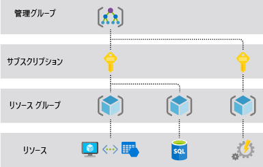
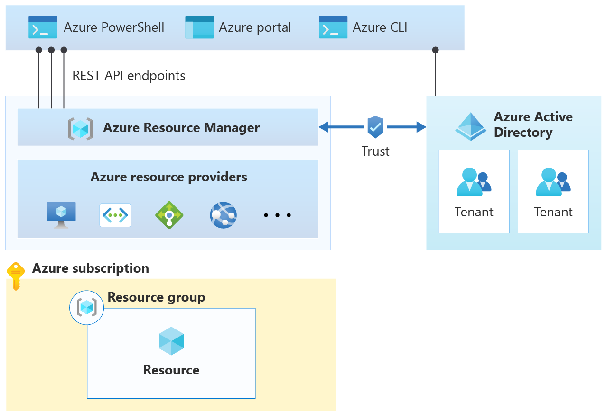

## Azureのリソース管理

業務でリソースアカウントを扱う必要があったんですが、権限やロールの関係でアクセスできなかった事がありました。

AzureADのロールでは該当するロールが見当たらず探してたところ、__リソースグループ__ に自分を追加する必要がありました。

Azureのリソースに対してのロール管理はAzureADとは別であるみたいで、あんまり知らなかったのでまとめてみました。

- [公式ドキュメント](https://learn.microsoft.com/ja-jp/azure/cloud-adoption-framework/get-started/how-azure-resource-manager-works)

### 階層構造

Azureリソース全体の管理構成は、リソースを管理するための階層がいくつかあり、下記の図のようになります。

上記のスコープをまとめて管理するシステムを  __AzureResorceManager(ARM)__  と言います。

#### Azure の用語

上記の階層構造の用語の説明です。

- __管理グループ__：組織に多数の Azure サブスクリプションがある場合の管理システムで 範囲はサブスクリプションを上回ります。管理グループを使うと、サブスクリプションの種類に関係なく、エンタープライズ レベルの管理を大規模に行うことができます。

- __リソース__ : Azure によって管理されるエンティティ。 Azure 仮想マシン、仮想ネットワーク、ストレージ アカウントなどが例として挙げられます。

- __サブスクリプション__ : リソースの論理コンテナー。 各 Azure リソースは、1 つのサブスクリプションだけに関連付けられます。 Azure の導入はサブスクリプションの作成から始まります。

- __リソース グループ__ : サブスクリプション内の関連するリソースをグループ化する論理コンテナー。 各リソースが所属できるリソース グループは 1 つに限られます。 リソース グループを使用すると、サブスクリプション内でより詳細なグループ化を行うことができます。 これらは一般に、サブスクリプション内のワークロード、アプリケーション、または特定の機能をサポートするために必要な資産のコレクションを表すために使用されます

会社でAzureを運用するときに管理グループ単位でAzureを利用している会社があるのかなってくらい細かいですね。

#### AzureResorceManager(ARM)と、AzureAcitveDirectory(AzureAD)の関係

AzureADはARMとは別の専用のインスタンスとして扱っていて、ARMでは、Azureリソースの展開時にアクセス権限とセキュリティを管理するために、Azure AD のユーザーやグループを使用します。

Azure AD はユーザーのアイデンティティ管理とアクセス制御を担当し、ARM はAzure リソースの管理と展開を担当します。下記図のように、Azure AD のユーザーやグループを使用して、ARM を通じてリソースへのアクセスを制御することが可能です。

### Azureストレージアカウント

ストレージアカウントはAzureのストレージサービスで、データオブジェクト (BLOB、ファイル、キュー、テーブル)に対して、HTTP,HTTPS経由でアクセスできる場所です。

ストレージアカウントはリソースグループによってまとめられていて、そこでロールを追加しないと管理者としてデータオブジェクトにアクセスできなかったです。

#### Azureストレージアカウントのデータオブジェクト

データオブジェクトについて具体的に記載すると、下記の項目になります。

- Azure BLOB:テキストおよびバイナリ データのための高度にスケーラブルなオブジェクト ストア。 また、Data Lake Storage Gen2 によるビッグ データ分析のサポートも含まれています。
- Azure Files:クラウドまたはオンプレミスのデプロイ用のマネージド ファイル共有。
- Azure Elastic SAN (プレビュー): Azure での SAN のデプロイ、スケーリング、管理、構成を簡略化する完全に統合されたソリューション。
- Azure キュー:アプリケーション コンポーネント間の信頼性の高いメッセージングのためのメッセージング ストア。
- Azure テーブル:構造化データのスキーマレス ストレージのための NoSQL ストア。
- Azure マネージド ディスク: Azure VM のブロックレベルのストレージ ボリューム。

また別の記事でこのデータの扱いについて、例えば、Azure BLOB StoageのSASについて書きたいです。