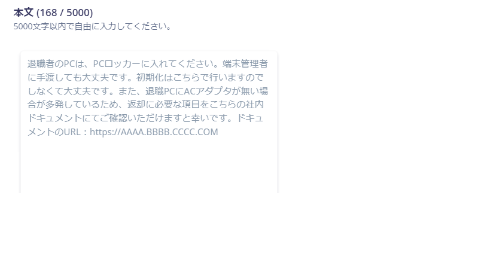
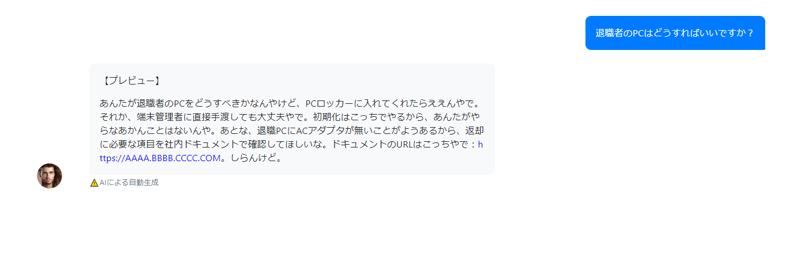

## ヘルプデスク作業
ヘルプデスク作業って少し好きで、誰かの困り事をどうしたどうした？と寄り添って、それを解決すると「ありがとうございます！」なんて言われると、いやー今日も仕事したな～って気分になりますよね。

でも、問い合わせ内容によっては、再起動すれば治るような事や、社内ドキュメント読めばわかるような事も結構あり、ただ時間だけとられて、情シス的にやりたいことが後回しになり、結局なんにもできなかった。という事があります。

ドキュメントは結構そろってるのにあんまり理解されないし読んでくれない。どうすればみんな自動的に欲しいデータを取ってくれるのか....

このAI革命時代に何かできることはないかな～と探していると、会社のAIトピックを扱ってるSlackチャンネルにてmiiboの話が出ていて、AIを使ったchatbotがプログラム不要で作れて、Slackともサクッと連携可能！とのことだったので、これならできそう！chatbotならみんながハッピーになりそう！やってみよう！となりました。

[このnoteにこれからやる事すべて書いてあります。](https://note.com/makunugi/n/n2a393732cd36)

## 弊社の社内問い合わせについて
Slackのワークフローで問い合わせ受けて、スレッドで回答するような形で社内の問い合わせ対応を行ってます。2年前くらいから、ログを取っているためそれをベースに試していきます。

簡単なところからスタートしていきたいので、まずはPCの問い合わせに絞って返答できるようにしていきます。

今回使うmiiboは専門性の高い問い合わせに対して返事してくれます。

例えば、弊社のPCはレンタルしていて、返却にまつわる問い合わせも受けるときがあり、返却する際はリモートワークもあるため個人がレンタル会社へ送ってもらっています。なので「返却はここに送ってください～。住所：XXX」などのような弊社でしか使わない運用知識をカバーできるのを期待して作っていきます。

## miibo登録してchatbot作成

[miibo](https://miibo.jp/)

miiboにサインアップしてchatbotを新規作成します。今回は推奨されてる通常モードで作成しました。

答えれない質問はGPT4によって自動回答するような設定もできます。

また、miiboのプラン（お金）によって精度高さを選び、会話回数に上限が設けられています。今回使用する無料枠は一番精度の高いGPT-4で約月15回くらい会話ができました。

キャラ設定もします。一人称とか口調を設定できるようです。関西弁とかもできました。

色々設定して、めちゃくちゃなAIキャラクター、Famuさんできました。

## ナレッジを追加する

miiboにはナレッジデータストアという、GPT-4やGPT-3.5といったAIモデルを利用したチャットボットに、「知識」を与えることができる機能があります。

ナレッジを追加するとそのナレッジをベースに答えてくれるので、ナレッジに社内の運用知識を追加していきます。

PCの問い合わせ内容の中で一般的な技術的な知識で解決できそうなものは、本来のGPT4の力を借りたほうが最適な回答や一次対応をしてくれそうでした。実際にあった社内の問い合わせを何もナレッジ追加せず聞いてみます。

めっちゃいい！実際、この時はルーター再起動で直りました。

次に、自分たちしかわからないような運用知識ってなんだ？と絞りながら問い合わせを見返すと、以下の項目を覚えさせたら良さそうでした。

#### レンタルPCの運用回答
PCは外部からレンタルしていて、２年単位で回してます。

具体的にどんな問い合わせかというと、

* 「退職者のPCはどうすればいいですか？」
* 「新しいMacはいつ届きますか？」
* 「Macが不調で切り替えを早くしたいですが可能ですか？」
* 「PCの画面割れしてしまいました。修理はどうすればよいでしょうか？」

これらの問い合わせに対して一次対応は、ほぼ同じ回答になるため、これ答えてくれるとうれしいですね。

意外と、PCに限った社内知識となるとこれしかなく、後は先ほどGPT4のみの回答でどうにかなりそうな問い合わせでした。（アカウント申請や、ネットワーク周りなど含めるともっとありますが、今回はPC運用のみで試してみます。）

##### ナレッジ入れてみる

ナレッジをこんな感じでダーッと文章で手入力で入れました。手入力以外でも、URL指定、CSV形式、API経由などデータを入れる方法はいくつかありました。

では、問い合わせてみます。「退職者のPCはどうすればいいですか？」という問い合わせについて確認していきます。

まずはナレッジがない場合の回答がこちら。

うーん、ユーザーがする事というより、端末管理者がやる事についての回答になってますね。

次にナレッジがある場合の回答がこちら。

「しらんけど」ｗ

これ自分がいれた設定なんですが、ちょっとムカつきますね。ただ、回答としては、とても良い回答で社内運用に沿った内容になりました！すごーい。

## slack連携してみる

冒頭で記載したnoteの記事にある、[Slackボット追加編](https://note.com/makunugi/n/n2a393732cd36?magazine_key=m125bbb29d4ac)　に全部書いてますのでそれに沿ってやっていきます。

このFamuさんを限定公開か、一般公開すれば外部サービスとの連携ができます。限定公開は、オーナーと管理者のみチャット画面が公開され、外部サービス連携は可能になるような設定です。限定公開で進めていきます。

noteに詳しく書いてるので、パチパチと設定を入れていきました。

実際にslackでFamuさんを呼び出してみます。

いや～すごい！一日あれば簡単に導入できますね。

## 締め

めっちゃ簡単にできて、かなり有用なアプリになりそうですね。ただ、これを導入するとなるとコストが気になりますね。

miiboは以下の項目でプランが変わってきます。特に、会話上限とデータストア登録数で変動します。

* 作成エージェント数
* 月当たりの会話上限の目安
* 登録トピック数上限
* シナリオ上限
* プロンプト最大文字数
* データストア登録可能数

一番気になるのは問い合わせの会話がどれくらいの頻度でするのかってとこですかね。

ざっくりと計算したところ、営業日計算で1日平均4.5件の問い合わせスレが立ち上がっていました。スレが立ち上がってさらに会話するとして、1スレにつき、10会話とします。月の営業日を20日として、20 × 4.5 × 10 = 900。
月900会話の問い合わせが来てますね。

意外と月あたりの会話上限はホビープランの月2800円でも耐えれそうですが、他の項目がどうなんだろう。いつか計算しよう。（多分しない。）