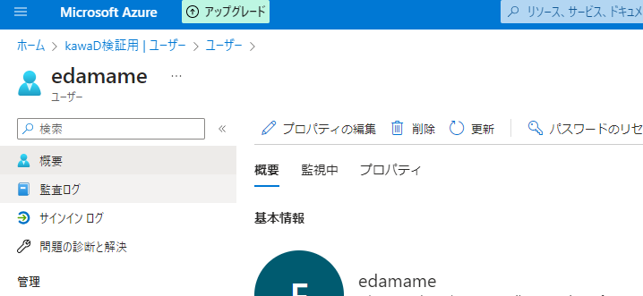

## Microsft Graph

・[Microsft Graph](https://learn.microsoft.com/ja-jp/graph/)

Microsoftの各サービスに対してスクリプトやコマンドを使ってリクエストを送信するには、Microsoft Graphを活用します。Microsoft Graphは、Microsoftのさまざまなサービスへの統一的なアクセスを提供するプラットフォームです。

今回は、PowerShellを使ってAzure ADの新しいユーザーを作成してみました。

## PowerShell

ざっくり下記やる事書き起こします。

1. Microsoft GraphのSDKをインストール
2. Azure上にMSGraphへ接続するためのアプリ作成・接続・認証する
3. AzureADのアカウントを作成するスクリプト作成・実行する

### Microsoft GraphのSDKをインストール

[参考MS公式ドキュメント](https://learn.microsoft.com/ja-jp/powershell/microsoftgraph/overview?toc=%2Fgraph%2Ftoc.json&view=graph-powershell-1.0)

まずpowershellを管理者権限で開いてSDKをインストールします。

```shell
# SDKインストール
Install-Package Microsoft.Graph
# インストールされてたらバージョン確認できる
Get-InstalledModule Microsoft.Graph 
```

もし、エラーでInstallできない場合、PowerShell 実行ポリシーを変えるとpowershellのコマンドやスクリプトが実行できます。
（自分はここでハマりました。）


```shell
Set-ExecutionPolicy -ExecutionPolicy RemoteSigned -Scope CurrentUser
```

・[実行ポリシー公式ドキュメント](https://learn.microsoft.com/ja-jp/powershell/module/microsoft.powershell.core/about/about_execution_policies?view=powershell-7.3)

### Azure上にMSGraphへ接続するためのアプリ作成

次にAzureのポータルサイトに入り、MSGraph用のアプリを作成します。

アプリ作成の手順は[こちら](https://learn.microsoft.com/ja-jp/powershell/microsoftgraph/app-only?view=graph-powershell-1.0&tabs=azure-portal)を参考にして進めます。

手順10の`Select Certificates & secrets under Manage. Select Upload certificate under Certificates. Browse to your certificate's public key file and select Add.` というのでハマり、証明書をアップロードってどうするの？と壁にぶち当たりました。

下記手順で自己証明書を発行してアップロードします。([こちらのサイト](https://jpazureid.github.io/blog/azure-active-directory/operating-license-with-microsoft-graph/#idx2-2)から引用してます。)

```shell
$mycert = New-SelfSignedCertificate -Subject "CN=SelfSignedCert" -CertStoreLocation "Cert:\CurrentUser\My"  -KeyExportPolicy Exportable -KeySpec Signature
#ここで出力されたファイルをアップロードする
$mycert | Export-Certificate -FilePath ".\SelfSignedCert.cer"  
$mycert | Select Thumbprint

```

上記コマンド生成した、SelfSignedCert.cerをアプリにアップロードします。

あとは、下記コマンドでAzure ADに接続できます。

```shell
Connect-MgGraph -Clientid "<登録したアプリのアプリケーション (クライアント) ID>" -TenantId "<アプリを登録したテナントのディレクトリ (テナント) ID>" -CertificateThumbprint "<証明書の拇印>"
Import-Module -Name Microsoft.Graph.Users
```

この辺の接続周りは先ほど紹介したMicrosoftのサポートブログを参考にしたほうがわかりやすいです。

・[Microsoft Graph PowerShell SDK を使用したライセンス管理操作の紹介](https://jpazureid.github.io/blog/azure-active-directory/operating-license-with-microsoft-graph/#idx2-2)


### AzureADのアカウントを作成するスクリプト実行する

[こちらのドキュメント](https://learn.microsoft.com/ja-jp/graph/api/group-post-members?view=graph-rest-1.0&tabs=http)に沿って`newAzureUser.ps1`というファイル作成して、ユーザー作成のコードを書いてきます。


```powershell

Import-Module Microsoft.Graph.Users

$params = @{
    # アカウントを有効
	accountEnabled = $true
    # 表示名
	displayName = "edamame"
	mailNickname = "edamame"
    # メールアドレス
	userPrincipalName = "edamame@AAA.CCCC.BBB.com"
    #　パスワード
	passwordProfile = @{
		forceChangePasswordNextSignIn = $true
		password = "任意でパスワードを入れます"
	}
}

New-MgUser -BodyParameter $params

```

上記実行すると、edamameさんが作成されました。




## 締め

ユーザー新規作成リクエストは別にpowershellじゃなくてもできるため、javascript使ってスプレッドシートにある入社情報からGASで実行するとか、Githubに社員台帳持っていて、actions回して棚卸とか色々自動化できそうでした。

powershellはこういった自動化というよりかは、調査のためにwindows端末から手軽にアクセスするっていうので使ったほうが良さそうですね。