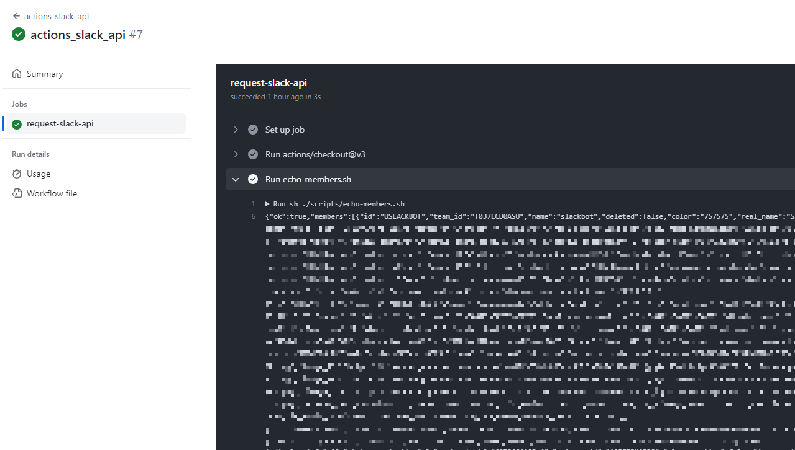

## アカウント棚卸

情シスを担当していると、SaaSアカウントの棚卸作業は非常に退屈ですよね。そこで、自動化できないかと考え、GitHub Actionsを利用してみることにしました。

GitHub Actionsを使用して、SlackのAPIを叩いてワークスペースのメンバーを出力することを試してみました。（棚卸までの機能はまだ完全ではありませんが、とりあえず試してみました）

内製せずに一括管理できるSaaSアカウント管理サービスも存在しますが、GitHub Actionsの動かし方に興味が湧いたので、試しに実行してみました。


## Github Action

Githubでpushやmergeなどのタイミングでスクリプトやコマンドを実行できる仕組み。

[詳しくはこちら](https://docs.github.com/ja/actions/learn-github-actions/understanding-github-actions?learn=getting_started&learnProduct=actions)

```
GitHub Actions は、ビルド、テスト、デプロイのパイプラインを自動化できる
継続的インテグレーションと継続的デリバリー (CI/CD) のプラットフォームです。
リポジトリに対するすべての pull request をビルドしてテストしたり、
マージされた pull request を運用環境にデプロイしたりするワークフローを作成できます。

GitHub Actions は、DevOps であるだけでなく、リポジトリで他のイベントが発生したときにワークフローを実行できます。
たとえば、リポジトリで新しい issue が作成されるたびに、
適切なラベルを自動的に追加するワークフローを実行できます。

GitHub では、ワークフローを実行するための Linux、Windows、macOS 仮想マシンが提供されます。
また、自身のデータセンターまたはクラウド インフラストラクチャで独自のセルフホスト ランナーをホストすることもできます。
```

githubアクションではLinuxなどの仮想環境立ち上げて、スクリプト実行して、ビルドしたりテストしたりDevOpsな事を自動化してくれます。

apiとか叩いて良い仕組みに持っていけないかなと思いました。

slackのapiを叩くようなスクリプトを用意して、ワークフローに組み込んで、実行できるかやってみます。

### ワークフロー

まずはワークフローを作っていきます。

リポジトリ配下に`.github/workflows`を作成して、そこにワークフローを定義していきます。

```yaml

name: actions_slack_api
on: 

  workflow_dispatch:

jobs:

  request-slack-api:
    runs-on: ubuntu-latest
    env: 
      SLACK_API_TOKEN: ${{ secrets.SLACK_API_TOKEN }}
    steps:
      - uses: actions/checkout@v3
      - name: Run echo-members.sh
        run: sh ./scripts/echo-members.sh

```

SlackのAPIトークンをGithubのSecretに保存して管理下に置いたんですが、それをどうやって持ってくるのかってとこではまりました。

```
    env: 
      SLACK_API_TOKEN: ${{ secrets.SLACK_API_TOKEN }}

      run: sh ./scripts/echo-members.sh

```
これでワークフローに呼び出して、シェルスクリプトに環境変数として呼べばいけました。

次にecho-members.shを作成して、slackのワークスペースにいるuserを取ってきます。


### シェルスクリプト作成


`./scripts/echo-members.sh`のようなディレクトリ構成でシェルスクリプトを作成します。

Ubuntu呼び出してるので、RubyとかJavascriptの環境も作れるようですが、ここではshellでサクッとやっていきます。

```shell
#!/bin/bash

# Slack APIのエンドポイントとトークンを設定
API_ENDPOINT="https://slack.com/api/users.list"
SLACK_TOKEN=$SLACK_API_TOKEN

# curlコマンドを使ってAPIを呼び出し、結果を変数に格納
response=$(curl -s -X POST -H "Authorization: Bearer $SLACK_TOKEN" $API_ENDPOINT)

# レスポンスを表示（デバッグ用）
echo $response
```

これをGithubにあげて、ワークフローを手動実行してみます。




だだだ～っととれました。

## 締め

アカウントの棚卸しする場合、人事台帳がGithubに上がってたら、いい感じに運用できそうだなと思いましたが、人事台帳をGithubベースに持っていくのが大変かもですね。